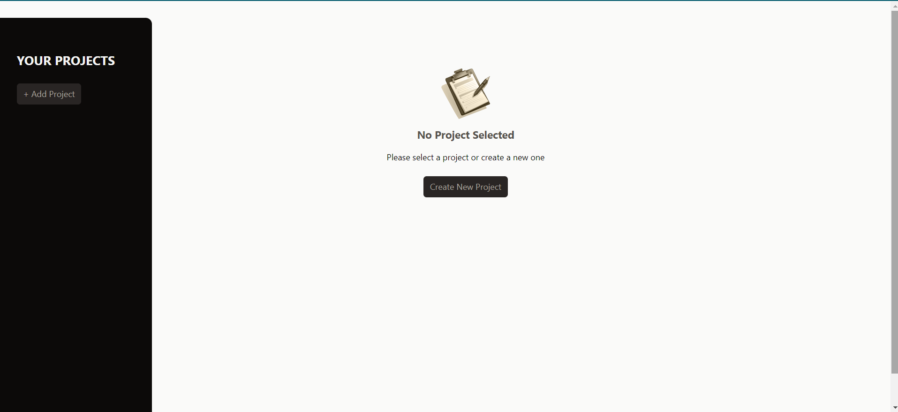
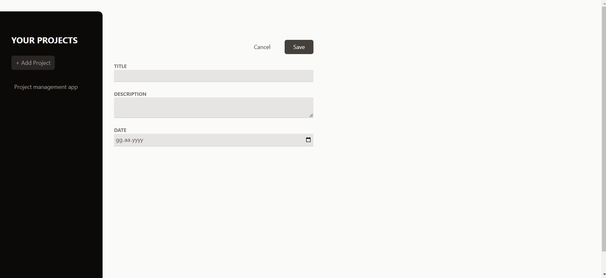
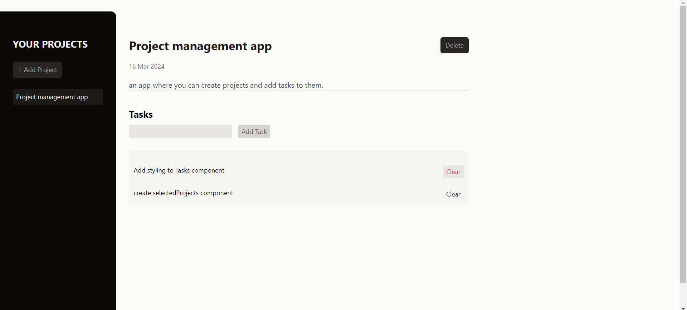

# ReactProjectManagementApp

A basic project management app where you can create projects and add tasks to them. 
> App is not connected to a database,  Which means you will lose you data and projects when the page refreshes.

## Images

